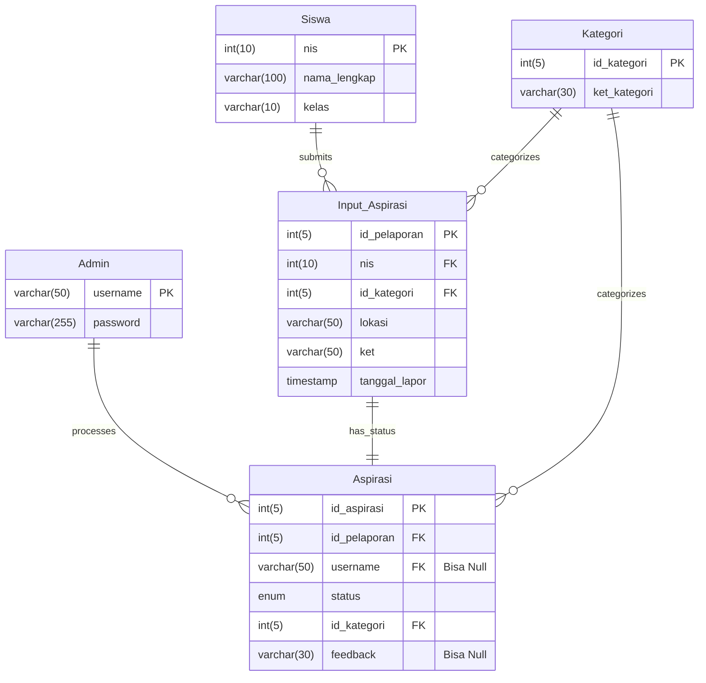
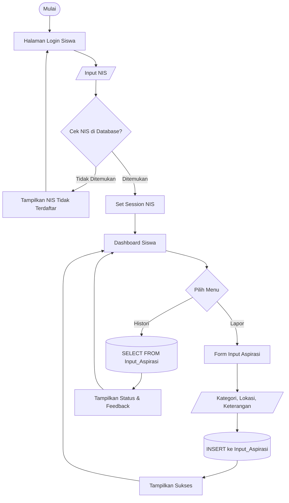

# School Aspirations Management System

Sistem ini merupakan aplikasi manajemen aspirasi sekolah berbasis **PHP Native** yang memungkinkan siswa menyampaikan aspirasi dan admin memproses serta memberikan feedback.

---

## 🛠️ Tech Stack

- PHP (Native)
- HTML & CSS
- MySQL

---

## 📄 Database Documentation

Database pada sistem ini digunakan untuk menyimpan seluruh data yang dibutuhkan, mulai dari data pengguna, kategori aspirasi, hingga aspirasi yang dikirimkan oleh siswa, beserta status dan feedback yang dikelola oleh admin secara teratur dan saling terhubung.

### Admin

```sql
CREATE TABLE Admin (
    Username VARCHAR(50) NOT NULL,
    password VARCHAR(255) NOT NULL,
    PRIMARY KEY (Username)
);
```

### Siswa

```sql
CREATE TABLE Siswa (
    nis INT(10) NOT NULL,
    kelas VARCHAR(10) NOT NULL,
    nama_lengkap VARCHAR(255) NOT NULL,
    PRIMARY KEY (nis)
);
```

### Kategori

```sql
CREATE TABLE Kategori (
    Id_kategori INT(5) NOT NULL AUTO_INCREMENT,
    ket_kategori VARCHAR(30) NOT NULL,
    PRIMARY KEY (Id_kategori)
);
```

### Input_Aspirasi

```sql
CREATE TABLE Input_Aspirasi (
    id_pelaporan INT(5) NOT NULL AUTO_INCREMENT,
    nis INT(10) NOT NULL,
    id_kategori INT(5) NOT NULL,
    lokasi VARCHAR(50) NOT NULL,
    ket VARCHAR(50) NOT NULL,
    tanggal_lapor TIMESTAMP NULL DEFAULT CURRENT_TIMESTAMP(),
    PRIMARY KEY (id_pelaporan),
    FOREIGN KEY (nis) REFERENCES Siswa(nis) 
        ON DELETE CASCADE ON UPDATE CASCADE,
    FOREIGN KEY (id_kategori) REFERENCES Kategori(id_kategori) 
        ON DELETE CASCADE ON UPDATE CASCADE
);
```

### Aspirasi

```sql
CREATE TABLE Aspirasi (
    id_aspirasi INT(5) NOT NULL AUTO_INCREMENT,
    id_pelaporan INT(5) NOT NULL,
    username VARCHAR(50) DEFAULT NULL,
    status ENUM('Menunggu', 'Proses', 'Selesai') NOT NULL,
    id_kategori INT(5) NOT NULL,
    feedback VARCHAR(30) DEFAULT NULL,
    PRIMARY KEY (id_aspirasi),
    FOREIGN KEY (id_pelaporan) REFERENCES Input_Aspirasi(id_pelaporan) 
        ON DELETE CASCADE ON UPDATE CASCADE,
    FOREIGN KEY (username) REFERENCES Admin(username) 
        ON DELETE SET NULL ON UPDATE CASCADE,
    FOREIGN KEY (id_kategori) REFERENCES Kategori(id_kategori) 
        ON DELETE CASCADE ON UPDATE CASCADE
);
```

---

## 📊 Diagram Database (ERD)



---

## 🔁 Flowchart Admin


---

## 🔁 Flowchart Siswa



---

## 📝 Update Log (v2.0)

### **Perbaikan Logika Database & Alur Data**
- **Sinkronisasi Otomatis:** Memperbarui logika pada `siswa/form.php`. Saat siswa mengirim aspirasi, sistem kini otomatis membuat *record* status awal ('Menunggu') di tabel `Aspirasi` menggunakan `LAST_INSERT_ID()`. Hal ini mencegah data tidak muncul di dashboard admin.
- **Relasi Tabel:** Mengubah ketergantungan tabel `Aspirasi` agar terhubung langsung dengan `Input_Aspirasi` melalui `id_pelaporan`.

### **Fitur Admin**
- **Perbaikan Bug Edit:** Memperbaiki logika di `admin/edit.php` dimana proses update status dan feedback kini mengacu pada `id_pelaporan` yang valid, mengatasi masalah "Data Tidak Ditemukan" saat mencoba menindaklanjuti laporan.
- **Dashboard Monitoring:** Mengoptimalkan query di `admin/dashboard.php` menggunakan `LEFT JOIN` yang lebih akurat untuk menampilkan status laporan dan feedback secara *real-time*.

### **Penyempurnaan Kode**
- Refactoring query SQL untuk efisiensi pengambilan data (`JOIN` table).
- Penambahan validasi ID pada halaman edit admin untuk mencegah error akses langsung.


---

## 👤 Author

- chx-bit

## 👥 Contributors
- [@Lightning-88](https://github.com/Lightning-88)

- [@Dhevanda04](https://github.com/Dhevanda04)