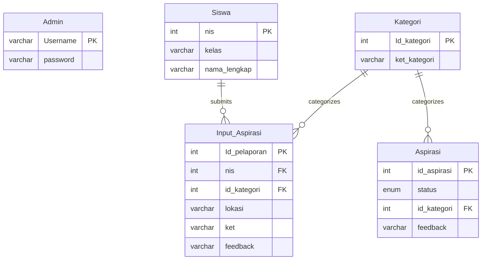
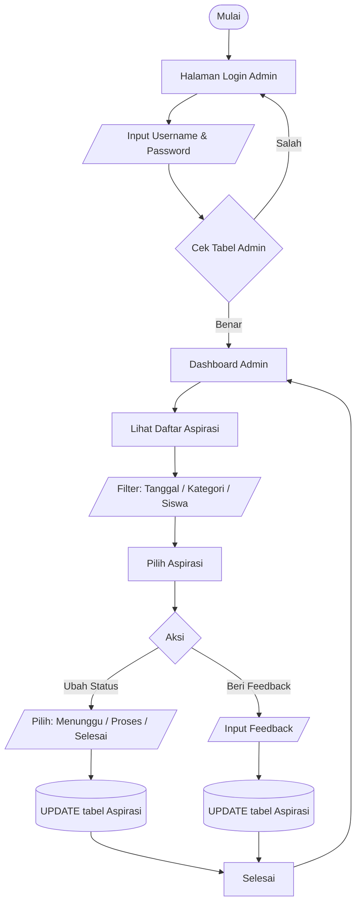

# School Aspirations Management System

Sistem ini merupakan aplikasi manajemen aspirasi sekolah berbasis **PHP Native** yang memungkinkan siswa menyampaikan aspirasi dan admin memproses serta memberikan feedback.

---

## 🛠️ Tech Stack

- PHP (Native)
- HTML & CSS
- MySQL

---

## 📄 Database Documentation

Database pada sistem ini digunakan untuk menyimpan seluruh data yang dibutuhkan, mulai dari data pengguna, kategori aspirasi, hingga aspirasi yang dikirimkan oleh siswa, beserta status dan feedback yang dikelola oleh admin secara teratur dan saling terhubung.

### Admin

```sql
CREATE TABLE Admin (
    Username VARCHAR(50) NOT NULL,
    password VARCHAR(255) NOT NULL,
    PRIMARY KEY (Username)
);
```

### Siswa

```sql
CREATE TABLE Siswa (
    nis INT(10) NOT NULL,
    kelas VARCHAR(10) NOT NULL,
    nama_lengkap VARCHAR(255) NOT NULL,
    PRIMARY KEY (nis)
);
```

### Kategori

```sql
CREATE TABLE Kategori (
    Id_kategori INT(5) NOT NULL AUTO_INCREMENT,
    ket_kategori VARCHAR(30) NOT NULL,
    PRIMARY KEY (Id_kategori)
);
```

### Input_Aspirasi

```sql
CREATE TABLE Input_Aspirasi (
    Id_pelaporan INT(5) NOT NULL AUTO_INCREMENT,
    nis INT(10) NOT NULL,
    id_kategori INT(5) NOT NULL,
    lokasi VARCHAR(50) NOT NULL,
    ket VARCHAR(50) NOT NULL,
    feedback VARCHAR(30) NOT NULL,
    PRIMARY KEY (Id_pelaporan),
    CONSTRAINT fk_input_siswa
        FOREIGN KEY (nis) REFERENCES Siswa(nis)
        ON DELETE CASCADE ON UPDATE CASCADE,
    CONSTRAINT fk_input_kategori
        FOREIGN KEY (id_kategori) REFERENCES Kategori(Id_kategori)
        ON DELETE CASCADE ON UPDATE CASCADE
);
```

### Aspirasi

```sql
CREATE TABLE Aspirasi (
    id_aspirasi INT(5) NOT NULL AUTO_INCREMENT,
    status ENUM('Menunggu', 'Proses', 'Selesai') NOT NULL,
    id_kategori INT(5) NOT NULL,
    feedback VARCHAR(30) NOT NULL,
    PRIMARY KEY (id_aspirasi),
    CONSTRAINT fk_aspirasi_kategori
        FOREIGN KEY (id_kategori) REFERENCES Kategori(Id_kategori)
        ON DELETE CASCADE ON UPDATE CASCADE
);
```

---

## 📊 Diagram Database (ERD)



---

## 🔁 Flowchart Admin



---

## 🔁 Flowchart Siswa


---

## 📝 Update Log

- Menambahkan kolom `nama_lengkap` **NOT NULL** pada tabel `Siswa`
- Mengubah tipe data kolom `feedback` pada tabel `Input_Aspirasi` menjadi `VARCHAR(30)`
- Mengubah tipe data kolom `feedback` pada tabel `Aspirasi` menjadi `VARCHAR(30)`
- Menambahkan dokumentasi **Flowchart Admin**
- Menambahkan dokumentasi **Flowchart Siswa**
- Menambahkan **Diagram Database (ERD)** sesuai Document Version
- Merapikan struktur README agar lebih konsisten dan profesional

---

## 👤 Author

- chx-bit

## 👥 Contributors
- [@Lightning-88](https://github.com/Lightning-88)

- [@Dhevanda04](https://github.com/Dhevanda04)
